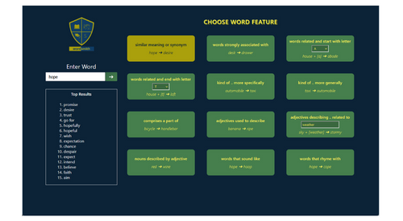

# Wordsmith  
Wordsmith is a web app built to provide word suggestions related to a word or phrase.  
It makes requests of the Datamuse API for it's functionality.  
No API key is required to use this API.  
The app offers 12 different features of word searches. Three of them have a second input.  
It's an HTML5 doc, a CSS3 stylesheet, a JavaScript script and a local logo image and favicon.  
  
